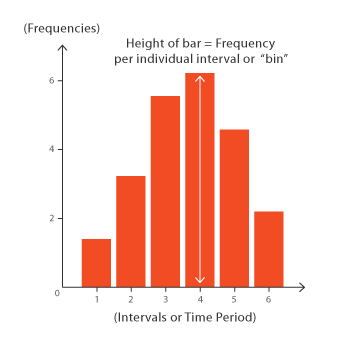
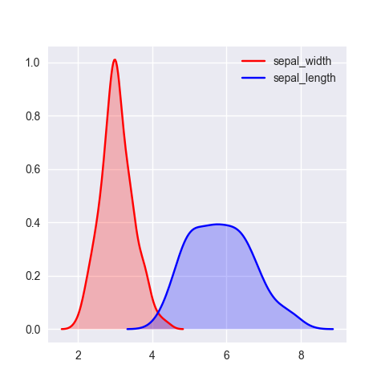
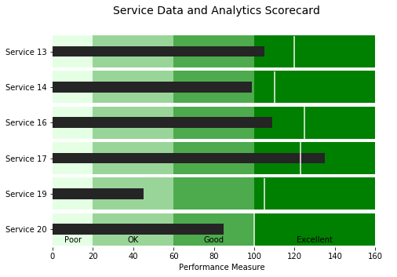

# DataVizGuide
provides common charts, when to use them, and code examples
 
| Charts (click for example)        | Description   | Examples|
| ------------- |:-------------:| -----:  |
|[Box and Whisker Plot](/DataVizGuide/box-and-whisker.ipynb)       | useful when comparing distributions between many groups or datasets. |    |
| [Histogram](/DataVizGuide/histogram.ipynb)      | useful for giving a rough view of the probability distribution|      |
| [Density Plots](/DataVizGuide/densityplot.ipynb) | Density Plots are better at determining the distribution shape because they're not affected by the number of bins used   | |
| [Bullet Chart](/DataVizGuide/bullet_chart.ipynb) | useful for showing progress to goal across groups | |
| [Scatter Plot](/DataVizGuide/scatter_chart.ipynb) | useful to detect relationships or correlations between two variables | |
