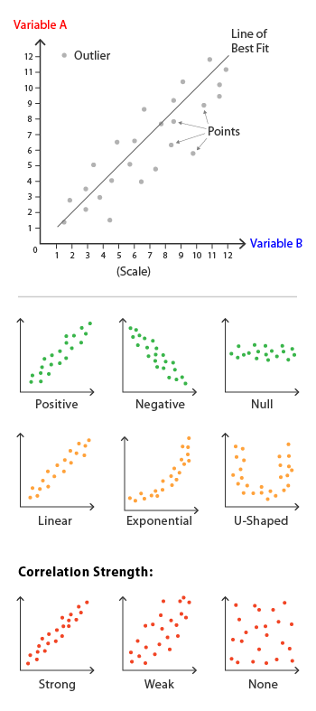

# DataVizGuide
provides common charts, when to use them, and code examples
 
| Charts (click for code example)        | Description   | Examples|
| ------------- |:-------------:| -----:  |
|[Box and Whisker Plot](https://github.com/markcav/DataVizGuide/blob/master/box-and-whisker.ipynb)| useful when comparing distributions between many groups or datasets. |    |
| [Histogram](https://github.com/markcav/DataVizGuide/blob/master/histogram.ipynb)      | useful for giving a rough view of the probability distribution|      |
| [Density Plots](https://github.com/markcav/DataVizGuide/blob/master/density_plot.ipynb) | Density Plots are better at determining the distribution shape because they're not affected by the number of bins used   | |
| [Bullet Chart](https://github.com/markcav/DataVizGuide/blob/master/bullet_chart.ipynb) | useful for showing progress to goal across groups | |
| [Scatter Plot](https://github.com/markcav/DataVizGuide/blob/master/scatter_plot.ipynb) | useful to detect relationships or correlations between two variables | |
